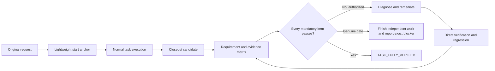

<div align="center">
  
  <p><strong>Do not report the missing half. Finish it, verify it, and only then close the task.</strong></p>
  <p>
    
    
    
    
  </p>
</div>

## Why this exists

Long agent tasks often fail quietly: a request contains 100 obligations, 50 are implemented, and a confident summary claims all 100. Other runs drift away from the original request, treat green tests as proof of product acceptance, or stop after reporting gaps that remain safe and authorized to fix.

**Verified Completion Loop** is a Codex closeout skill for that failure mode. It preserves the original request, checks bidirectional requirement coverage, separates authority from desired outcomes, and turns retryable findings back into implementation work.



## The operating model

The skill stays deliberately light during normal execution:

1. **Anchor:** Preserve every original user message and later change, plus constraints, prohibitions, authority, and deliverables.
2. **Sleep:** Let the primary workflow research, design, implement, test, and integrate.
3. **Close the loop:** At final delivery, partition the complete source without gaps, map every normative segment to requirements, verify current evidence, remediate authorized gaps, and recheck regressions.

It is a closeout completion controller, not a heavyweight project manager.

## Five non-negotiable invariants

| Invariant | What it prevents |
|---|---|
| **Source coverage is complete** | A whole omitted paragraph disappearing before requirement counting |
| **Authority boundaries are preserved** | “Finish everything” becoming permission to deploy, spend, delete, or read secrets |
| **Governance is proportional but complete** | Small tasks drowning in ceremony while large tasks escape rigor |
| **Evidence is current and reproducible** | Old tests, screenshots, hashes, or PR states proving a new claim |
| **Semantic conclusions are challenged** | A valid-looking matrix hiding wrong ownership, omitted authorities, or an overbroad final claim |

## Three evidence levels

| Level | Best for | Added rigor |
|---|---|---|
| `LIGHT` | Short, reversible, low-risk work | Concise direct checks |
| `STANDARD` | Multi-step or multi-file work | Requirement matrix, tests, regressions, repository state |
| `STRICT` | Production, providers, payments, migrations, governance, long prompts | Prospective identity, before/after proof, independent acceptance, live external evidence |

Every level preserves 100% requirement coverage. The level changes evidence cost, not truthfulness.

## Completion claims

```text
TASK_FULLY_VERIFIED
```

Only when every effective mandatory requirement passes with timestamped, reproducible evidence and there is no missing ID, source gap, scope drift, authority violation, retryable work, or relevant regression.

```text
ALL_AUTHORIZED_INDEPENDENT_WORK_COMPLETE
```

Only when all safe independent work is done and the remaining requirements are blocked by a precisely documented Owner decision, permission, capability, or external-state change. This is not whole-task completion.

```text
AUDIT_COMPLETE
```

For an audit-only task whose audit deliverables are complete. The audited subject may still contain defects; the skill never converts read-only authority into remediation authority.

## Machine-check the closeout manifest

The optional validator is dependency-free:

```bash
python scripts/validate_manifest.py path/to/completion-manifest.json
```

Manifest V3 checks:

- exact UTF-8 source-document identity;
- gap-free and overlap-free source-span coverage;
- contiguous declared and actual document, segment, and requirement IDs;
- bidirectional source-to-requirement mapping;
- preserved replacement and revocation history;
- timestamped evidence with reproducible provenance;
- source-grounded authority and material observed actions;
- regression evidence and STRICT before/after proof;
- blocker attempts, exhausted alternatives, and exact requirement coverage;
- explicit discovery of authoritative and target artifacts;
- complete semantic-review coverage of requirements and inspected artifacts;
- five adversarial checks, including a separate review of the proposed final response;
- completion-claim eligibility.

```text
COMPLETION_MANIFEST status=PASS claim=TASK_FULLY_VERIFIED mandatory=12 pass=12 blocked=0
```

The validator proves manifest integrity and blocks a closeout that skipped artifact discovery or semantic challenge. It cannot prove that review prose is truthful. Codex must still inspect actual files, tests, runtime, Git, PRs, providers, or Owner acceptance. A fresh independent reviewer is preferred; a disclosed adversarial second pass is the fallback.

The full-source manifest is local and temporary. Never upload it. If source messages contain secrets or private content that must not be written to disk, perform the same complete span review in memory and disclose that machine validation was intentionally not used; never pass a redacted source off as complete coverage.

## Install

Clone directly into your Codex skills directory:

```bash
git clone https://github.com/zzk-kun/verified-completion-loop.git ~/.codex/skills/verified-completion-loop
```

Invoke it explicitly:

```text
$verified-completion-loop
```

Implicit invocation is enabled, but a skill cannot turn model routing into a hard pre-final hook. For reliable long-task closeout, add a workspace rule that requires this skill and, where the host supports it, an external trajectory assertion or pre-final receipt check. The repository does not claim guaranteed automatic invocation without that host enforcement.

## V3 hardening

V3 was built from real false-completion cases where every manifest row passed but later review found omitted authorities, wrong ownership, and completion prose broader than the evidence. The fix adds:

- artifact discovery before evidence selection;
- a reviewer-isolated semantic challenge;
- exact checks for omission, ownership, contradictions, and final-response alignment;
- automatic return of authorized findings to the remediation loop;
- explicit disclosure when only self-adversarial review is available.

V3 manifests are intentionally not backward-compatible with V2. Regenerate temporary closeout manifests so the new artifact and semantic-review gates cannot be silently bypassed.

The design follows mature patterns rather than inventing a second project-management system: [OpenAI's evaluation guidance](https://developers.openai.com/api/docs/guides/latest-model) recommends representative evals and evaluating tool output separately from the final response; [GitHub Spec Kit](https://github.com/github/spec-kit/blob/main/templates/commands/analyze.md) uses cross-artifact requirement inventories and coverage analysis; [Superpowers](https://github.com/obra/superpowers/blob/main/skills/verification-before-completion/SKILL.md) requires fresh evidence before completion claims; and [Promptfoo](https://www.promptfoo.dev/docs/configuration/expected-outputs/model-graded/) demonstrates combining deterministic and model-graded assertions. The independent-review preference is also supported by research on evaluator self-preference: [LLM Evaluators Recognize and Favor Their Own Generations](https://proceedings.neurips.cc/paper_files/paper/2024/hash/5edb8885e6f63de0c1f8b11a9e0e95a1-Abstract-Conference.html).

## Repository layout

```text
verified-completion-loop/
├── SKILL.md
├── agents/openai.yaml
├── references/protocol.md
├── references/semantic-challenge.md
├── evals/cases.json
├── scripts/validate_manifest.py
├── tests/test_validate_manifest.py
└── assets/
```

## Design boundaries

- It does not grant new authority.
- It does not turn an audit-only request into an implementation request.
- It does not lower acceptance criteria to reach 100%.
- It does not add speculative work to inflate the matrix.
- It does not stop at a retryable finding when remediation remains authorized.
- It does not busy-loop: every retry must add evidence, diagnosis, strategy, or relevant state change.

## License

MIT
