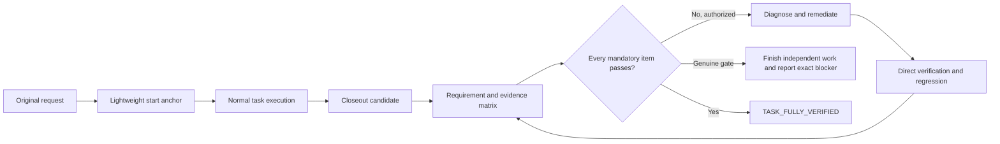

<div align="center">
  
  <p><strong>Do not report the missing half. Finish it, verify it, and only then close the task.</strong></p>
  <p>
    
    
    
    
  </p>
</div>

## Why this exists

Long agent tasks often fail quietly: a request contains 100 obligations, 50 are implemented, and a confident summary claims all 100. Other runs drift away from the original request, treat green tests as proof of product acceptance, or stop after reporting gaps that remain safe and authorized to fix.

**Verified Completion Loop** is a Codex closeout skill for that failure mode. It preserves the original request, checks bidirectional requirement coverage, separates authority from desired outcomes, and turns retryable findings back into implementation work.



## The operating model

The skill stays deliberately light during normal execution:

1. **Anchor:** Preserve the original request, constraints, prohibitions, authority, and deliverables.
2. **Sleep:** Let the primary workflow research, design, implement, test, and integrate.
3. **Close the loop:** At final delivery, map every normative source segment to requirements, verify current evidence, remediate authorized gaps, and recheck regressions.

It is a closeout completion controller, not a heavyweight project manager.

## Four non-negotiable invariants

| Invariant | What it prevents |
|---|---|
| **Source coverage is complete** | A missing requirement disappearing from the denominator |
| **Authority boundaries are preserved** | “Finish everything” becoming permission to deploy, spend, delete, or read secrets |
| **Governance is proportional but complete** | Small tasks drowning in ceremony while large tasks escape rigor |
| **Evidence is current and reproducible** | Old tests, screenshots, hashes, or PR states proving a new claim |

## Three evidence levels

| Level | Best for | Added rigor |
|---|---|---|
| `LIGHT` | Short, reversible, low-risk work | Concise direct checks |
| `STANDARD` | Multi-step or multi-file work | Requirement matrix, tests, regressions, repository state |
| `STRICT` | Production, providers, payments, migrations, governance, long prompts | Prospective identity, before/after proof, independent acceptance, live external evidence |

Every level preserves 100% requirement coverage. The level changes evidence cost, not truthfulness.

## Completion claims

```text
TASK_FULLY_VERIFIED
```

Only when every mandatory requirement passes with current evidence and there is no missing ID, scope drift, authority violation, retryable work, or relevant regression.

```text
ALL_AUTHORIZED_INDEPENDENT_WORK_COMPLETE
```

Only when all safe independent work is done and the remaining requirements are blocked by a precisely documented Owner decision, permission, capability, or external-state change. This is not whole-task completion.

```text
AUDIT_COMPLETE
```

For an audit-only task whose audit deliverables are complete. The audited subject may still contain defects; the skill never converts read-only authority into remediation authority.

## Machine-check the closeout manifest

The optional validator is dependency-free:

```bash
python scripts/validate_manifest.py path/to/completion-manifest.json
```

It checks source/requirement mapping, duplicate IDs, current evidence markers, authority violations, scope drift, regression failures, blocker coverage, and completion-claim eligibility.

```text
COMPLETION_MANIFEST status=PASS claim=TASK_FULLY_VERIFIED mandatory=12 pass=12
```

The validator proves manifest integrity, not the truth of evidence statements. Codex must still inspect actual files, tests, runtime, Git, PRs, providers, or Owner acceptance as the requirement demands.

## Install

Clone directly into your Codex skills directory:

```bash
git clone https://github.com/zzk-kun/verified-completion-loop.git ~/.codex/skills/verified-completion-loop
```

Invoke it explicitly:

```text
$verified-completion-loop
```

Automatic invocation is enabled. For reliable long-task closeout, add a workspace rule that requires this skill before the final response for substantial multi-step tasks.

## Repository layout

```text
verified-completion-loop/
├── SKILL.md
├── agents/openai.yaml
├── references/protocol.md
├── scripts/validate_manifest.py
├── tests/test_validate_manifest.py
└── assets/
```

## Design boundaries

- It does not grant new authority.
- It does not turn an audit-only request into an implementation request.
- It does not lower acceptance criteria to reach 100%.
- It does not add speculative work to inflate the matrix.
- It does not stop at a retryable finding when remediation remains authorized.
- It does not busy-loop: every retry must add evidence, diagnosis, strategy, or relevant state change.

## License

MIT
